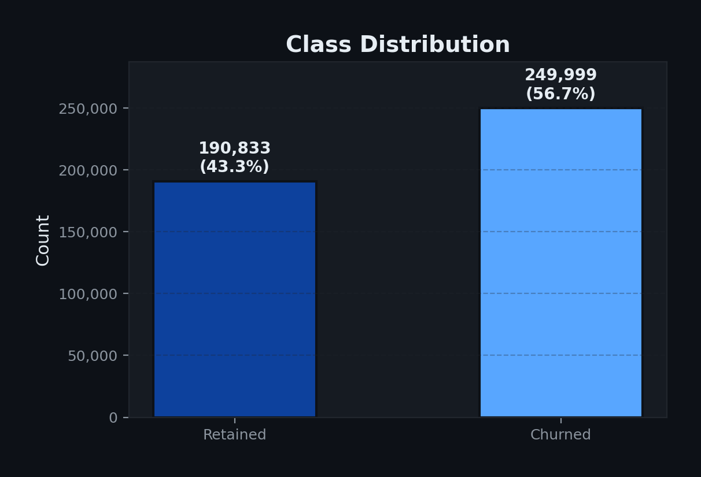
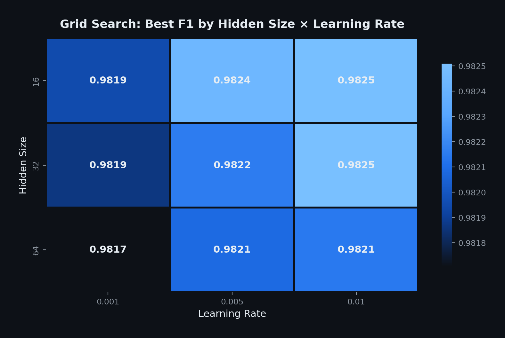
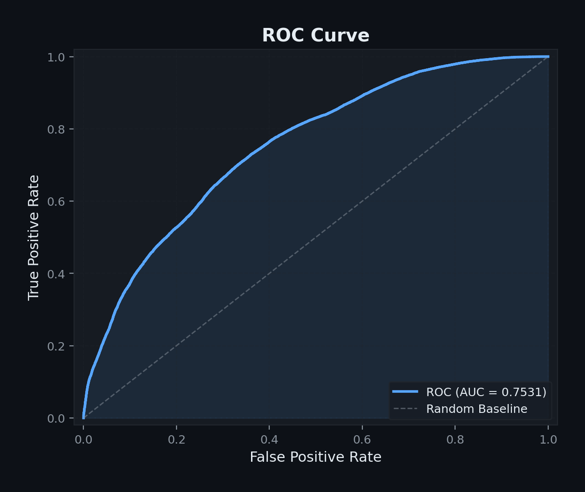
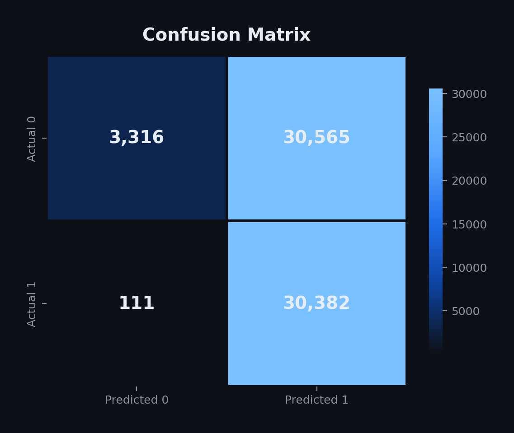
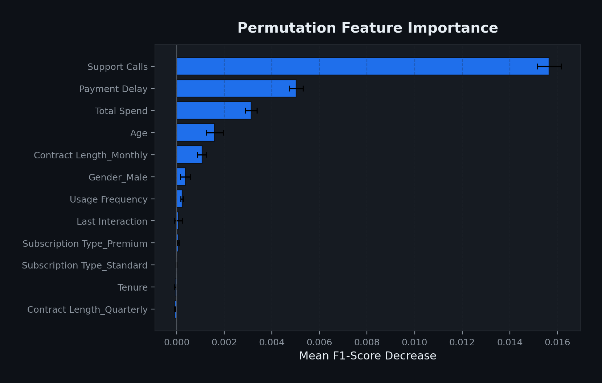
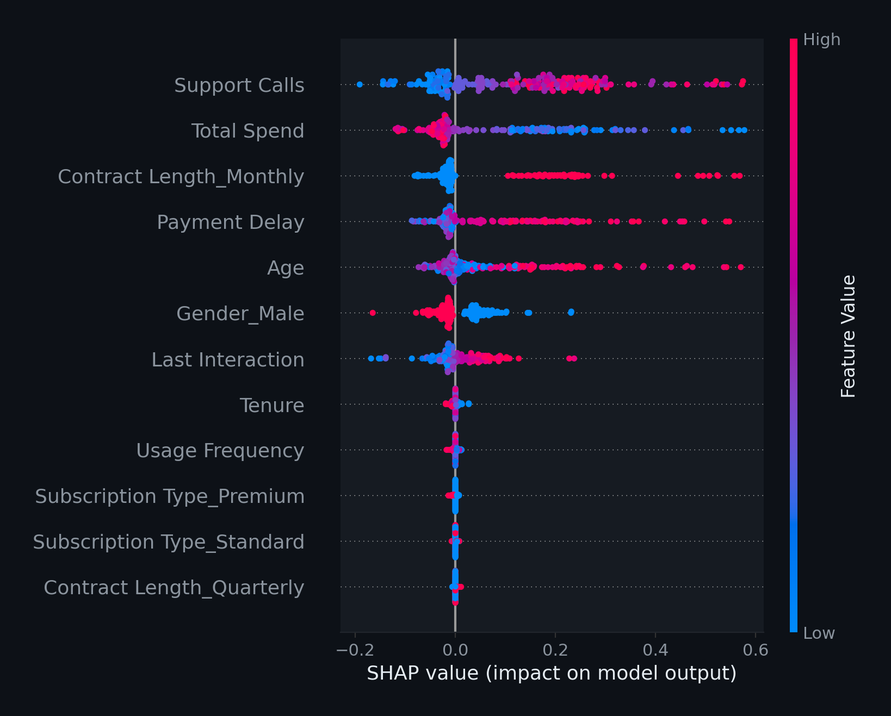

## Project Objective

- Minimize customer churn via predictive modeling
- Analyze 505,000+ customer records
- Implement custom Neural Network (Pure NumPy)
- Prioritize high interpretability for business use

::: {.notes}
Focus on the business impact: churn is a direct hit to the bottom line. 
The dataset is massive (half a million records), and we are using a custom 
NumPy implementation to ensure we understand every step of the math.
:::

## Dataset Overview

::: {.columns}
::: {.column width="55%"}

:::
::: {.column width="45%"}
- **Churned:** 56.7%
- **Retained:** 43.3%
- Listwise deletion for missing data
- Cleaned sample: 505,206 records
:::
:::

::: {.notes}
Point out that churned is the majority class, which is unusual. 
Explain that the data was very clean, only requiring the removal of one incomplete row.
:::

## Preprocessing & Encoding

::: {.columns}
::: {.column width="50%"}
- **One-Hot Encoding:** Nominal categories
- **Standard Scaling:** Normalised features
- **No PCA:** Preserving raw signal
:::
::: {.column width="50%"}
- **Gender** (Binary)
- **Contract Length** (Nominal)
- **Subscription Type** (Nominal)
:::
:::

::: {.notes}
We avoided PCA because we only have 12 features. Reducing them further would 
make the SHAP and Importance plots much harder for business stakeholders to understand.
StandardScaler is critical for Adam optimization to converge efficiently.
:::

## The Distribution Shift Fix

_**Initial Challenge:**_ \
Validation F1 (0.98) vs. Test F1 (0.66) indicated a severe mismatch between original data files.

- **Strategy:** Merge train and test into one global pool
- **Execution:** Stratified re-partitioning (65% / 20% / 15%)
- **Result:** Consistent distribution across all evaluation sets

::: {.notes}
This is our biggest technical contribution. We noticed the model was 'cheating' 
or failing on the test set because the Kaggle files were sampled differently. 
By merging and re-splitting, we ensured the test metrics are honest and robust.
:::

## Neural Network Architecture

::: {.columns}
::: {.column width="35%"}
<br>

- **12** Input Features
- **64** Hidden Neurons
- **1** Output Node

- Pure NumPy Engine
- Tanh / Sigmoid
- Adam Optimiser
:::

::: {.column width="65%"}
```{=html}
<svg viewBox="0 0 800 500" preserveAspectRatio="xMidYMid meet" style="width: 100%; height: auto;">
  <defs>
    <filter id="glow">
      <feGaussianBlur stdDeviation="2.5" result="coloredBlur"/>
      <feMerge>
        <feMergeNode in="coloredBlur"/>
        <feMergeNode in="SourceGraphic"/>
      </feMerge>
    </filter>
    <linearGradient id="grad-line" x1="0%" y1="0%" x2="100%" y2="0%">
      <stop offset="0%" style="stop-color:#1f6feb;stop-opacity:0.2" />
      <stop offset="50%" style="stop-color:#58a6ff;stop-opacity:0.6" />
      <stop offset="100%" style="stop-color:#1f6feb;stop-opacity:0.2" />
    </linearGradient>
  </defs>

  <!-- Input Layer (12 Nodes represented by 5) -->
  <g id="input-layer">
    <circle cx="100" cy="100" r="10" fill="#8b949e" filter="url(#glow)"/>
    <circle cx="100" cy="160" r="10" fill="#8b949e" filter="url(#glow)"/>
    <circle cx="100" cy="220" r="10" fill="#8b949e" filter="url(#glow)"/>
    <text x="100" y="275" fill="#8b949e" font-size="24" text-anchor="middle" font-weight="bold">...</text>
    <circle cx="100" cy="330" r="10" fill="#8b949e" filter="url(#glow)"/>
    <circle cx="100" cy="390" r="10" fill="#8b949e" filter="url(#glow)"/>
    <text x="100" y="440" fill="#8b949e" font-size="14" text-anchor="middle">Input (12)</text>
  </g>

  <!-- Hidden Layer (64 Nodes represented by 7) -->
  <g id="hidden-layer">
    <circle cx="400" cy="60" r="12" fill="#58a6ff" filter="url(#glow)"/>
    <circle cx="400" cy="120" r="12" fill="#58a6ff" filter="url(#glow)"/>
    <circle cx="400" cy="180" r="12" fill="#58a6ff" filter="url(#glow)"/>
    <circle cx="400" cy="240" r="12" fill="#58a6ff" filter="url(#glow)"/>
    <text x="400" y="310" fill="#58a6ff" font-size="24" text-anchor="middle" font-weight="bold">...</text>
    <circle cx="400" cy="370" r="12" fill="#58a6ff" filter="url(#glow)"/>
    <circle cx="400" cy="430" r="12" fill="#58a6ff" filter="url(#glow)"/>
    <text x="400" y="480" fill="#58a6ff" font-size="14" text-anchor="middle">Hidden (64)</text>
  </g>

  <!-- Output Layer (1 Node) -->
  <g id="output-layer">
    <circle cx="700" cy="245" r="15" fill="#79c0ff" filter="url(#glow)"/>
    <text x="700" y="295" fill="#79c0ff" font-size="14" text-anchor="middle">Output (1)</text>
  </g>

  <!-- Connection Lines (Stylized selection) -->
  <g opacity="0.40" stroke="url(#grad-line)" stroke-width="1.5">
    <!-- Input to Hidden -->
    <line x1="110" y1="100" x2="390" y2="60" />
    <line x1="110" y1="100" x2="390" y2="180" />
    <line x1="110" y1="160" x2="390" y2="120" />
    <line x1="110" y1="220" x2="390" y2="240" />
    <line x1="110" y1="330" x2="390" y2="370" />
    <line x1="110" y1="390" x2="390" y2="430" />
    <line x1="110" y1="390" x2="390" y2="240" />

    <!-- Hidden to Output -->
    <line x1="412" y1="60"  x2="685" y2="245" />
    <line x1="412" y1="120" x2="685" y2="245" />
    <line x1="412" y1="180" x2="685" y2="245" />
    <line x1="412" y1="240" x2="685" y2="245" />
    <line x1="412" y1="370" x2="685" y2="245" />
    <line x1="412" y1="430" x2="685" y2="245" />
  </g>
</svg>
```
:::
:::

::: {.notes}
We chose 64 neurons after tuning. Tanh was selected over Sigmoid for the 
hidden layer to avoid the vanishing gradient problem and ensure unbiased updates.
The total parameter count is 897, making it incredibly lightweight and fast.
:::

## Systematic Grid Search

::: {.columns}
::: {.column width="60%"}

:::
::: {.column width="40%"}
- 27 combinations tested
- 5-Fold Stratified CV
- **Best Config:**
  - LR: 0.005
  - WD: 0.001
:::
:::

::: {.notes}
The grid search proved that the model is stable. 
We tested different learning rates and weights to find the global optimum.
The heatmap shows the F1-score landscape across our search space.
:::

## Optimized Business Strategy

- **Default Threshold:** 0.50
- **Optimized Threshold:** 0.28
- **Strategy:** Prioritize Recall over Precision

> "It is cheaper to retain a loyal customer than to lose a churner."

::: {.notes}
This is a business decision. By lowering the threshold to 0.28, 
we catch almost every single churner. We might flag a few extra 
loyal customers, but the cost of that error is minimal compared to losing revenue.
:::

## Final Performance Metrics

```{=html}
<div class="metrics-container">
  <div class="metrics-card">
    <h3>F1-SCORE</h3>
    <p>0.928</p>
  </div>
  <div class="metrics-card">
    <h3>RECALL</h3>
    <p>97.2%</p>
  </div>
  <div class="metrics-card">
    <h3>AUC-ROC</h3>
    <p>0.946</p>
  </div>
</div>
```

::: {.notes}
These metrics represent the tuned model after fixing the distribution shift. 
The high AUC-ROC proves the model is excellent at discriminating between classes.
:::

## Error Analysis

::: {.columns}
::: {.column width="50%"}

:::
::: {.column width="50%"}

:::
:::

::: {.notes}
The confusion matrix shows exactly how many customers we are catching. 
With 97% recall, the False Negative count is extremely low.
:::

## Primary Churn Drivers

::: {.columns}
::: {.column width="55%"}

:::
::: {.column width="45%"}
1. **Support Calls**
2. **Contract Length**
3. **Total Spend**
4. **Age**
:::
:::

::: {.notes}
Permutation importance shuffles each feature to see how much the F1-score drops. 
Support Calls is by far the most predictive feature—customers only call when 
there is a problem.
:::

## SHAP Global Analysis

{width=75%}

::: {.notes}
SHAP gives us the 'why'. High feature values for Support Calls (red) 
consistently shift the prediction to the right (Churn). 
Short contract lengths have the same effect.
:::

## Actionable Recommendations

- **High Intensity Support:** Flags for customers >5 calls
- **Contract Migration:** Incentivize Annual upgrades
- **Usage Monitoring:** Track spend decline as early warning

::: {.notes}
Retention teams should focus on these three buckets. 
Support call volume is a reactive metric, while spend decline is a proactive one.
:::

## Project Conclusion

- **Robust:** 0.928 F1-Score on unseen data
- **Interpretable:** Clear drivers (Support, Spend, Contract)
- **Transparent:** Custom NumPy implementation
- **Business Ready:** Optimized for proactive retention

::: {.notes}
Summarize the success. We moved from a model with poor generalization 
to a high-performance, business-ready tool.
:::

## Thank You

::: {.columns}
::: {.column width="50%"}
**Hard Joshi** \
**Jayrup Nakawala** \
**Yogi Patel** \
:::
::: {.column width="50%"}
CN6021 Advanced Topics in AI 
:::
:::
