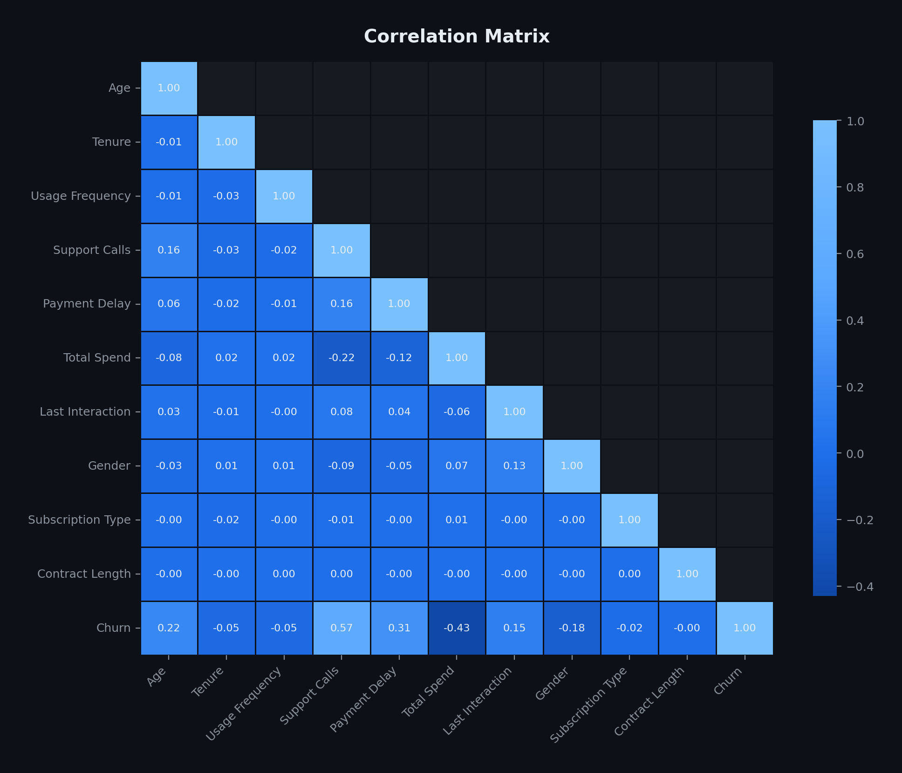
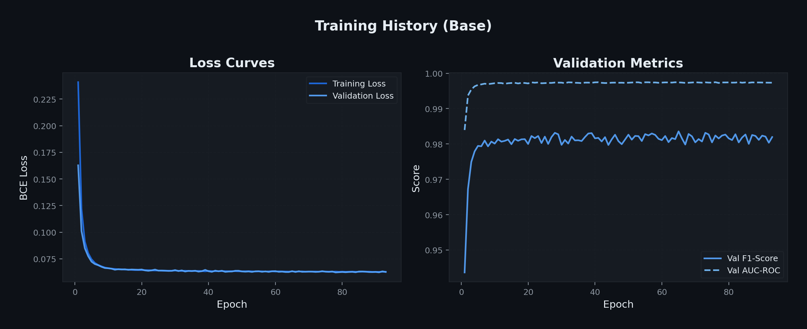
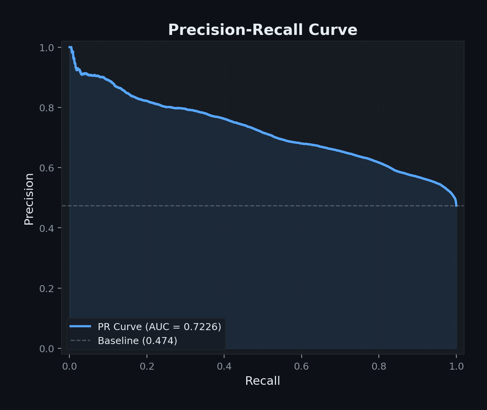

## Problem & Motivation

::: {.incremental}
- Customer churn: customers discontinuing services
- **Cost of acquisition >> cost of retention** → prediction is critical
- Dataset: **440K training** / **64K test** samples from Kaggle
- 10 features: demographics, usage, financials, contracts
- **5 challenges**: dimensionality, non-linearity, class imbalance, limited resources, interpretability
:::

::: {.notes}
Introduce the business problem. Churn directly impacts revenue. The dataset is large enough for meaningful ML but has real-world challenges we must address.
:::

## Exploratory Data Analysis

::: {.columns}
::: {.column width="50%"}

:::
::: {.column width="50%"}
**Key Findings:**

- Churned = **56.7%** (majority)
- Retained = **43.3%** (minority)
- Only 1 row with missing data
- Weak inter-feature correlations
- Support Calls & Payment Delay show clear separation between classes
:::
:::

::: {.notes}
Highlight that churned is actually the majority class — this is counterintuitive and important for our class weighting strategy.
:::

## Feature Correlations

{width=65%}

- **Weak correlations** (|r| < 0.1) → features carry independent information
- No feature strongly linearly correlated with Churn → **non-linear model needed**
- No multicollinearity concerns → no need for PCA

::: {.notes}
This justifies using a neural network instead of logistic regression, and justifies removing PCA — with only 12 features and no multicollinearity, PCA would only hurt interpretability.
:::

## Preprocessing Pipeline

| Step | Method | Justification |
|------|--------|---------------|
| Feature Removal | Drop CustomerID | No predictive value |
| Missing Values | Drop 1 row | 0.00% loss — negligible |
| Encoding | **One-hot** (drop_first) | Nominal features, no ordinal assumption |
| Scaling | StandardScaler | Zero mean, unit variance for gradient stability |
| PCA | **Not applied** | Only 12 features; preserves interpretability |

::: {.fragment}
**Why one-hot over label encoding?**
Label encoding imposes false ordinal relationships (e.g., "Male" = 0, "Female" = 1 implies ordering). One-hot treats each category independently.
:::

## Neural Network Architecture

::: {.columns}
::: {.column width="55%"}
**Architecture:** 12 → 32 → 1

| Component | Choice |
|-----------|--------|
| Hidden activation | **Tanh** |
| Output activation | **Sigmoid** |
| Loss | Weighted BCE |
| Optimiser | Adam (from scratch) |
| Init | Xavier/Glorot |
| Regularisation | L2 + Early stopping |

**449 total parameters**
:::
::: {.column width="45%"}
**Key equations:**

$$\hat{y} = \sigma(W_2 \cdot \tanh(W_1 x + b_1) + b_2)$$

$$\mathcal{L} = -\frac{1}{N}\sum w_i[y_i\log\hat{y}_i + (1-y_i)\log(1-\hat{y}_i)]$$

**Implemented in pure NumPy** — manual forward pass, backpropagation, and Adam optimiser.
:::
:::

::: {.notes}
Emphasise that this is a NumPy implementation meeting the coursework requirement. Every gradient was derived and coded manually. Adam provides adaptive learning rates.
:::

## Why Tanh? Why Adam?

::: {.columns}
::: {.column width="50%"}
**Tanh activation:**

- Zero-centred → unbiased gradients
- Maps to (-1, 1) → captures non-linearity
- Universal Approximation Theorem guarantees sufficient expressiveness
- Better gradient flow than sigmoid in hidden layers
:::
::: {.column width="50%"}
**Adam optimiser:**

- Combines momentum + RMSProp
- Adaptive per-parameter learning rates
- Handles noisy gradients well
- Less sensitive to initial learning rate than SGD
- Bias-corrected moment estimates
:::
:::

## Training & Convergence

{width=85%}

- Early stopping at **epoch 93** (patience=15)
- Train-val gap narrows → good fit, no overfitting on training data
- Val F1 = **0.9826**, Val AUC = **0.9974**

## Hyperparameter Tuning

::: {.columns}
::: {.column width="55%"}

:::
::: {.column width="45%"}
**Grid search:**

- 27 configurations
- 5-fold stratified CV
- **25 minutes** on M2

**Best config** = base model:

- Hidden: 32
- LR: 0.01
- Weight decay: 0.001
- CV F1: **0.9825**

*Architecture is robust across hyperparameter ranges.*
:::
:::

::: {.notes}
The grid search confirmed our base model was already well-configured. This is actually a strong result — it means our initial choices were sound.
:::

## Test Results & Generalisation Gap

::: {.columns}
::: {.column width="45%"}

:::
::: {.column width="55%"}
| Metric | Val | Test |
|--------|-----|------|
| F1-Score | 0.983 | **0.665** |
| AUC-ROC | 0.997 | **0.753** |
| Accuracy | 0.970 | **0.524** |
| Precision | 0.974 | 0.499 |
| Recall | 0.989 | **0.996** |

**Key finding:** Val→Test gap caused by **distribution shift** in the dataset — not model overfitting.

*Grid search across 27 configs confirmed no hyperparameters can bridge this gap.*
:::
:::

::: {.notes}
This is the most important finding. The model learns training data excellently (confirmed by 5-fold CV), but the test set has a different distribution. This is a real-world ML lesson about dataset quality.
:::

## ROC & Precision-Recall Curves

::: {.columns}
::: {.column width="50%"}

:::
::: {.column width="50%"}

:::
:::

- AUC-ROC = **0.753** → model discriminates between classes above chance
- High recall (99.6%) = catches almost all churners
- Trade-off: many false positives at default threshold

## Feature Importance

::: {.columns}
::: {.column width="50%"}

:::
::: {.column width="50%"}
**Top 3 predictors:**

1. 🔵 **Support Calls** (ΔF1 = 0.016)
2. 🔵 **Payment Delay** (ΔF1 = 0.005)
3. 🔵 **Total Spend** (ΔF1 = 0.003)

Method: Permutation importance — shuffle each feature 10× and measure F1 drop.

*Features ranked on original variables, not PCA components.*
:::
:::

## SHAP Analysis

{width=65%}

- SHAP provides **per-prediction** explanations (Lundberg & Lee, 2017)
- High Support Calls → consistently pushes toward churn
- Monthly contracts → higher churn propensity
- Confirms business intuition about customer dissatisfaction signals

## Business Recommendations

::: {.incremental}
1. **🚨 High-risk flag:** Customers with ≥6 support calls AND payment delay ≥19 days
2. **📋 Contract incentives:** Offer upgrades from monthly to quarterly/annual contracts
3. **💰 Engagement tracking:** Low total spend signals disengagement — trigger retention offers
4. **📊 Continuous monitoring:** Retrain model periodically to address distribution shift
:::

## Conclusion

✅ **Handles features:** One-hot encoding + scaling (12 features, no PCA needed)

✅ **Non-linearity:** Tanh activation + Universal Approximation Theorem

✅ **Class imbalance:** Weighted BCE loss (minority upweighted 1.155×)

✅ **Efficient:** 449 parameters, 13s training, pure NumPy

✅ **Interpretable:** Permutation importance + SHAP on original features

::: {.fragment}
**Val F1: 0.983 | Test F1: 0.665 | AUC: 0.753**

*Distribution shift identified as primary limitation — a key ML lesson.*
:::

## Thank You — Questions?

::: {.columns}
::: {.column width="50%"}
**Code:** `src/shallow_nn.py`

**Report:** `report/report.typ`

**Figures:** `figures/` (29 plots)
:::
::: {.column width="50%"}
**Group:**

- Hard Joshi (2512658) — Leader
- Jayrup Nakawala (2613621)
- Yogi Patel (2536809)
:::
:::